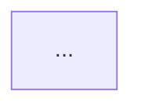

# Brooks-Lint

Code quality diagnosis using principles from six classic software engineering books.

> **Full skill with slash commands and Claude Code plugin support:**
> install from `--repo hyhmrright/brooks-lint --path skills/brooks-lint`

## The Iron Law

```
NEVER suggest fixes before completing risk diagnosis.
EVERY finding must follow: Symptom → Source → Consequence → Remedy.
```

Violating this law produces reviews that list rule violations without explaining why they
matter. A finding without a consequence and a remedy is not a finding — it is noise.

## When to Use

**Auto-triggers:**
- User asks to review code, check a PR, or assess code quality
- User shares code and asks "what do you think?" or "is this good?"
- User discusses architecture, module structure, or system design
- User asks why the codebase is hard to maintain, why velocity is declining
- User mentions: code smells, refactoring, clean architecture, DDD, SOLID, Brooks,
  conceptual integrity, second system effect, tech debt, ubiquitous language,
  test smells, test debt, unit testing quality, flaky tests, mock abuse,
  legacy code testability, characterization tests

## Mode Detection

Read the context and pick ONE mode before doing anything else.

| Context | Mode |
|---------|------|
| Code diff, specific files/functions, PR description, "review this" | **Mode 1: PR Review** |
| Project directory structure, module questions, "audit the architecture" | **Mode 2: Architecture Audit** |
| "tech debt", "where to refactor", health check, systemic maintainability questions | **Mode 3: Tech Debt Assessment** |
| Test files shared, "are our tests good?", test debt, flaky tests, mock abuse, legacy code testability | **Mode 4: Test Quality Review** |

**If context is genuinely ambiguous after reading:** ask once — "Should I do a PR-level code
review, a broader architecture audit, or a tech debt assessment?" — then proceed without
further clarification questions.

## The Six Decay Risks

(Full definitions, symptoms, sources, and severity guides are in `references/decay-risks.md` —
read it after selecting a mode.)

| Risk | Diagnostic Question |
|------|---------------------|
| Cognitive Overload | How much mental effort to understand this? |
| Change Propagation | How many unrelated things break on one change? |
| Knowledge Duplication | Is the same decision expressed in multiple places? |
| Accidental Complexity | Is the code more complex than the problem? |
| Dependency Disorder | Do dependencies flow in a consistent direction? |
| Domain Model Distortion | Does the code faithfully represent the domain? |

## Modes

### Mode 1: PR Review

1. Read `references/pr-review-guide.md` for the analysis process
2. Read `references/decay-risks.md` for symptom definitions and source attributions
3. Scan the diff or code for each decay risk in the order specified in the guide
4. Apply the Iron Law to every finding
5. Output using the Report Template below

### Mode 2: Architecture Audit

1. Read `references/architecture-guide.md` for the analysis process
2. Read `references/decay-risks.md` for symptom definitions and source attributions
3. Draw the module dependency graph as a Mermaid diagram (Step 1 of the guide)
4. Scan for each decay risk in the order specified in the guide
5. Assign node colors in the Mermaid diagram based on findings (red/yellow/green)
6. Run the Conway's Law check
7. Output using the Report Template below — Mermaid graph FIRST, then Findings

### Mode 3: Tech Debt Assessment

1. Read `references/debt-guide.md` for the analysis process
2. Read `references/decay-risks.md` for symptom definitions and source attributions
3. Scan for all six decay risks; list every finding before scoring any of them
4. Apply the Pain x Spread priority formula
5. Output using the Report Template below, plus the Debt Summary Table

### Mode 4: Test Quality Review

1. Read `references/test-guide.md` for the analysis process
2. Read `references/test-decay-risks.md` for symptom definitions and source attributions
3. Build the test suite map (unit/integration/E2E counts and ratio)
4. Scan for each test decay risk in the order specified in the guide
5. Output using the Report Template below

## Report Template

````
# Brooks-Lint Review

**Mode:** [PR Review / Architecture Audit / Tech Debt Assessment / Test Quality Review]
**Scope:** [file(s), directory, or description of what was reviewed]
**Health Score:** XX/100

[One sentence overall verdict]

---

## Module Dependency Graph

<!-- Mode 2 (Architecture Audit) ONLY — omit this section for other modes -->



---

## Findings

<!-- Sort all findings by severity: Critical first, then Warning, then Suggestion -->

### 🔴 Critical

**[Risk Name] — [Short descriptive title]**
Symptom: [exactly what was observed in the code]
Source: [Book title — Principle or Smell name]
Consequence: [what breaks or gets worse if this is not fixed]
Remedy: [concrete, specific action]

### 🟡 Warning

**[Risk Name] — [Short descriptive title]**
Symptom: ...
Source: ...
Consequence: ...
Remedy: ...

### 🟢 Suggestion

**[Risk Name] — [Short descriptive title]**
Symptom: ...
Source: ...
Consequence: ...
Remedy: ...

---

## Summary

[2–3 sentences: what is the most important action, and what is the overall trend]
```

## Health Score Calculation

Base score: 100
Deductions:
- Each 🔴 Critical finding: −15
- Each 🟡 Warning finding: −5
- Each 🟢 Suggestion finding: −1
Floor: 0 (score cannot go below 0)

## Reference Files

Read on demand — do not preload all files:

| File | When to Read |
|------|-------------|
| `references/decay-risks.md` | After selecting a mode, before starting the review |
| `references/pr-review-guide.md` | At the start of every Mode 1 (PR Review) |
| `references/architecture-guide.md` | At the start of every Mode 2 (Architecture Audit) |
| `references/debt-guide.md` | At the start of every Mode 3 (Tech Debt Assessment) |
| `references/test-guide.md` | At the start of every Mode 4 (Test Quality Review) |
| `references/test-decay-risks.md` | After selecting Mode 4, before starting the review |
