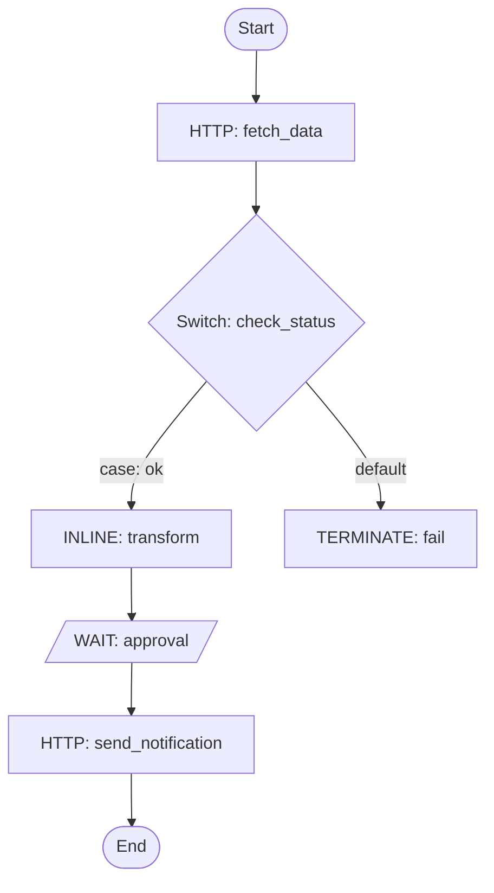

# Conductor Workflows

## Rules

- **Never use `python3 -c`** for any purpose — not to construct JSON, parse output, format results, or post-process data. Instead:
  - Write JSON to files using the Write tool or heredoc, then pass the file path to CLI commands.
  - Format and summarize command output directly in your response text. You can read and interpret JSON output yourself — do not spawn Python to do it.
- **Always install and use the `conductor` CLI**. If it's missing, install it (`npm install -g @conductor-oss/conductor-cli`). Only fall back to `scripts/conductor_api.py` if Node.js/npm cannot be installed.
- **Use `--json` flags** when available to get structured output from the CLI, then summarize the results in your response text.
- **Never echo auth tokens** in output or logs.
- **Infer the profile from context.** When the user mentions an environment (e.g. "dev", "prod", "staging"), append `--profile {env}` to CLI commands. If unsure which profile to use, list available profiles by reading `~/.conductor-cli/config.yaml` and ask the user to confirm.

## Prerequisites

Check for the `conductor` CLI and install it if missing:

```bash
conductor --version || npm install -g @conductor-oss/conductor-cli
```

If npm/Node.js is not available, install Node.js first:

```bash
# macOS
brew install node
# Linux (Debian/Ubuntu)
curl -fsSL https://deb.nodesource.com/setup_lts.x | sudo -E bash - && sudo apt-get install -y nodejs
```

Then install the CLI: `npm install -g @conductor-oss/conductor-cli`

**Fallback** — Only if Node.js/npm truly cannot be installed (e.g. restricted environment), use the bundled REST API script:

```bash
export CONDUCTOR_API="<path-to-this-skill>/scripts/conductor_api.py"
```

### Connecting to a server

If no Conductor server is running, you have two options:

**Option A — Start a local server:**

```bash
conductor server start
# Optionally specify port or version:
conductor server start --port 8080 --version latest
```

Verify it's running: `conductor server status`

**Option B — Connect to an existing server:**

```bash
export CONDUCTOR_SERVER_URL="http://your-server:8080/api"
```

Then check if the server requires authentication:

```bash
conductor workflow list
```

If you get a 401/403 error, the server requires auth. Set credentials using one of:

```bash
# Key + Secret (recommended for Orkes/Enterprise)
export CONDUCTOR_AUTH_KEY="your-key"
export CONDUCTOR_AUTH_SECRET="your-secret"

# Or a pre-existing token
export CONDUCTOR_AUTH_TOKEN="your-token"
```

### Saving connection profiles

Save named profiles to avoid setting env vars each time:

```bash
# Local server (no auth)
conductor config save --server http://localhost:8080/api --profile local

# Remote server with auth
conductor config save --server https://play.orkes.io/api --auth-key KEY --auth-secret SECRET --profile orkes

# Use a profile
conductor workflow list --profile orkes
```

Profiles are stored in `~/.conductor-cli/config.yaml`.

Never echo auth tokens, keys, or secrets in output.

## 1) Workflow definitions

Create and manage workflow definitions. See [workflow-definition.md](references/workflow-definition.md) for JSON schema and task types.

### List all definitions

```bash
conductor workflow list
# Fallback: python3 "$CONDUCTOR_API" list-workflows
```

### Get a definition

```bash
conductor workflow get {name}
# Fallback: python3 "$CONDUCTOR_API" get-workflow --name {name} --version {version}
```

### Create a definition

**Step 1**: Write the workflow JSON to a `.json` file using the Write tool (or `cat << 'EOF' > workflow.json`).

**Step 2**: Register the workflow:

```bash
conductor workflow create workflow.json
# Fallback: python3 "$CONDUCTOR_API" create-workflow --file workflow.json
```

Always write to a file first, then pass the file path to the CLI or script.

### Update a definition

```bash
conductor workflow update workflow.json
# Fallback: python3 "$CONDUCTOR_API" update-workflow --file workflow.json
```

### Delete a definition

```bash
conductor workflow delete {name} {version}
# Fallback: python3 "$CONDUCTOR_API" delete-workflow --name {name} --version {version}
```

## 2) Running workflows

### Start a workflow (async)

Returns the workflow execution ID. Use `-i` for small inline JSON or `-f` for larger inputs:

```bash
conductor workflow start -w {name} -i '{"key": "value"}'
# For larger inputs, write a file first then use -f:
conductor workflow start -w {name} -f input.json
# Fallback: python3 "$CONDUCTOR_API" start-workflow --name {name} --input '{"key": "value"}'
```

### Start with version and correlation ID

```bash
conductor workflow start -w {name} --version {version} --correlation {correlationId} -i '{"key": "value"}'
# Fallback: python3 "$CONDUCTOR_API" start-workflow --name {name} --version {version} --correlation-id {correlationId} --input '{"key": "value"}'
```

### Execute synchronously

Wait for the workflow to complete or reach a specific task:

```bash
conductor workflow start -w {name} -i '{"key": "value"}' --sync
# Wait until a specific task completes:
conductor workflow start -w {name} -i '{"key": "value"}' --sync -u {taskRefName}
```

### Start from a file

```bash
conductor workflow start -w {name} -f input.json
```

## 3) Monitoring workflows

### Get execution status

```bash
conductor workflow get-execution {workflowId}
# Complete details with tasks:
conductor workflow get-execution {workflowId} -c
# Fallback: python3 "$CONDUCTOR_API" get-execution --id {workflowId} --include-tasks
```

### Search executions

```bash
# By status:
conductor workflow search -s RUNNING -c 20
# By workflow name and status:
conductor workflow search -w {name} -s FAILED -c 10
# By time range:
conductor workflow search -s COMPLETED --start-time-after "2024-01-01" --start-time-before "2024-01-31"
# Fallback: python3 "$CONDUCTOR_API" search-workflows --status RUNNING --size 20
```

Statuses: `RUNNING`, `COMPLETED`, `FAILED`, `TIMED_OUT`, `TERMINATED`, `PAUSED`

### Quick status check

```bash
conductor workflow status {workflowId}
```

## 4) Managing workflows

### Pause and resume

```bash
conductor workflow pause {workflowId}
conductor workflow resume {workflowId}
# Fallback: python3 "$CONDUCTOR_API" pause-workflow --id {workflowId}
# Fallback: python3 "$CONDUCTOR_API" resume-workflow --id {workflowId}
```

### Terminate

```bash
conductor workflow terminate {workflowId}
# Fallback: python3 "$CONDUCTOR_API" terminate-workflow --id {workflowId} --reason "terminated by agent"
```

### Restart a completed workflow

```bash
conductor workflow restart {workflowId}
# Use latest workflow definition:
conductor workflow restart {workflowId} --use-latest
# Fallback: python3 "$CONDUCTOR_API" restart-workflow --id {workflowId}
```

### Retry the last failed task

```bash
conductor workflow retry {workflowId}
# Fallback: python3 "$CONDUCTOR_API" retry-workflow --id {workflowId}
```

### Rerun from a specific task

```bash
conductor workflow rerun {workflowId} --task-id {taskId}
```

### Skip a task

```bash
conductor workflow skip-task {workflowId} {taskRefName}
```

### Jump to a task

```bash
conductor workflow jump {workflowId} {taskRefName}
```

## 5) Signaling tasks

Signal tasks to advance workflow execution. Use for WAIT tasks, HUMAN tasks, or any task awaiting external input.

### Signal a task (async)

```bash
conductor task signal --workflow-id {workflowId} --task-ref {taskRefName} --status COMPLETED --output '{"result": "approved"}'
# Fallback: python3 "$CONDUCTOR_API" signal-task --workflow-id {workflowId} --task-ref {taskRefName} --status COMPLETED --output '{"result": "approved"}'
```

### Signal a task (sync — returns updated workflow)

```bash
conductor task signal-sync --workflow-id {workflowId} --task-ref {taskRefName} --status COMPLETED --output '{"result": "done"}'
# Fallback: python3 "$CONDUCTOR_API" signal-task-sync --workflow-id {workflowId} --task-ref {taskRefName} --status COMPLETED --output '{"result": "done"}'
```

Task statuses: `COMPLETED`, `FAILED`, `FAILED_WITH_TERMINAL_ERROR`

## 6) Task management

### Poll for tasks

```bash
conductor task poll {taskType} --count 5
# Fallback: python3 "$CONDUCTOR_API" poll-task --task-type {taskType} --count 5
```

### Update a task execution

```bash
conductor task update-execution --workflow-id {workflowId} --task-ref-name {taskRefName} --status COMPLETED --output '{"key": "value"}'
```

### Check queue sizes

```bash
conductor task queue-size --task-type {taskType}
# Fallback: python3 "$CONDUCTOR_API" queue-size --task-type {taskType}
```

## 7) Local development

Start a local Conductor server for testing:

```bash
conductor server start
conductor server status
conductor server logs -f
conductor server stop
```

## 8) Enterprise features (Orkes)

These require Orkes Conductor (orkes.io):

- **Schedules**: `conductor schedule list/create/update/delete/pause/resume`
- **Secrets**: `conductor secret list/get/put/delete`
- **Webhooks**: `conductor webhook list/create/update/delete`

## 9) Workflow visualization

Generate a Mermaid flowchart when users ask to visualize a workflow, or after creating a workflow definition. This renders in any Markdown viewer (GitHub, VS Code, Codex).

### Diagram rules

- Use `flowchart TD` for sequential workflows, `flowchart LR` for wide parallel flows
- Only use `-->` arrows and `-->|label|` for labeled edges
- Do NOT use `title`, `style`, `classDef`, or special characters `{}[]()` in edge labels
- Keep node labels short: task type + reference name, e.g. `fetch_data[HTTP: fetch_data]`

### Mapping Conductor constructs

| Construct | Mermaid pattern |
|-----------|----------------|
| Sequential tasks | `task1 --> task2 --> task3` |
| SWITCH (decision) | `sw{Switch: ref}` with `-->|case: value|` edges per case + `-->|default|` |
| FORK_JOIN (parallel) | `fork[Fork] --> branch_a & branch_b` then both `--> join[Join]` |
| DO_WHILE (loop) | `loop[DO_WHILE: ref] --> body --> loop` with `body -->|done| next` |
| SUB_WORKFLOW | `sub([Sub: workflow_name])` rounded node |
| WAIT / HUMAN | `wait[/WAIT: ref/]` parallelogram to indicate external input |

### Example

````markdown

````

### Conductor UI

If a Conductor server is running, interactive workflow visualizations are available at the server UI (typically port `8080` or `5000` — the same host as `CONDUCTOR_SERVER_URL` without the `/api` path).

## Output formatting

- Present workflow data as structured summaries: workflowId, status, startTime, endTime, failedTask details.
- For searches, show a table with workflowId, name, status, and startTime.
- On failures, include the failed task name, error message, and retry count.
- Never echo auth tokens or secrets in output.

## Troubleshooting

- **CLI not found**: Install via `npm install -g @conductor-oss/conductor-cli`, or use the bundled `scripts/conductor_api.py` fallback.
- **Connection refused**: Verify `CONDUCTOR_SERVER_URL` is correct and the server is running.
- **401 Unauthorized**: Check `CONDUCTOR_AUTH_TOKEN` is set and valid.
- **404 Not Found**: Verify the workflow name, version, or execution ID exists.
- **Docs**: https://orkes.io/content/ for detailed Conductor documentation.
- **API Reference**: See [api-reference.md](references/api-reference.md) for REST endpoint details.
