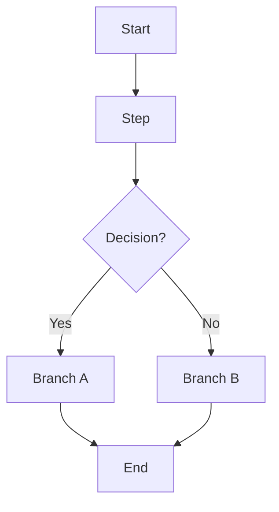
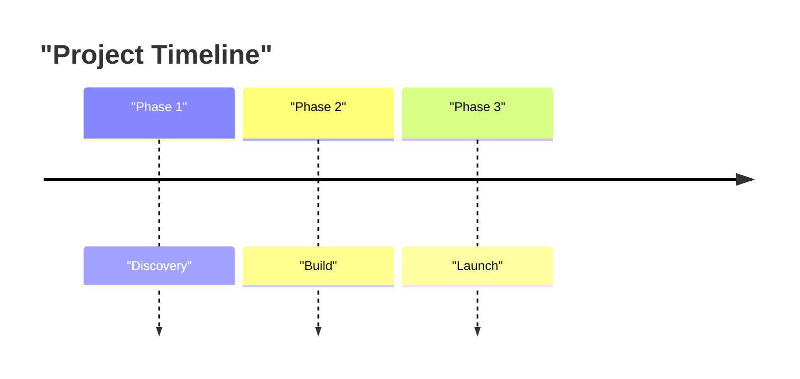
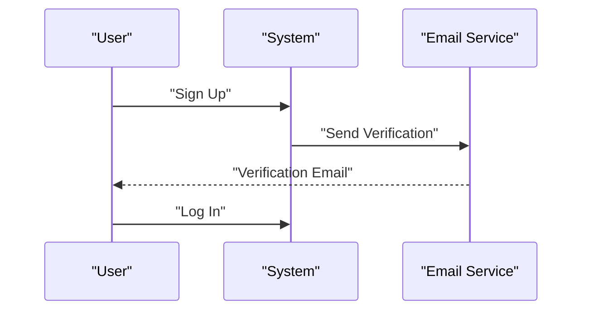
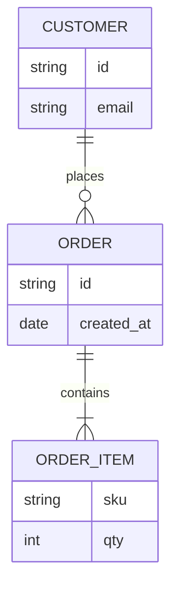
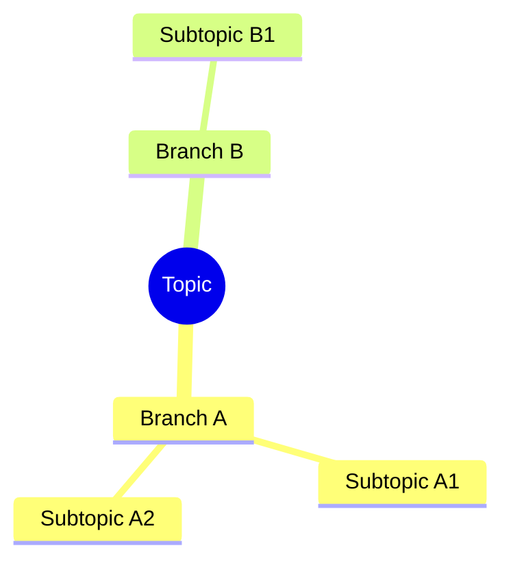
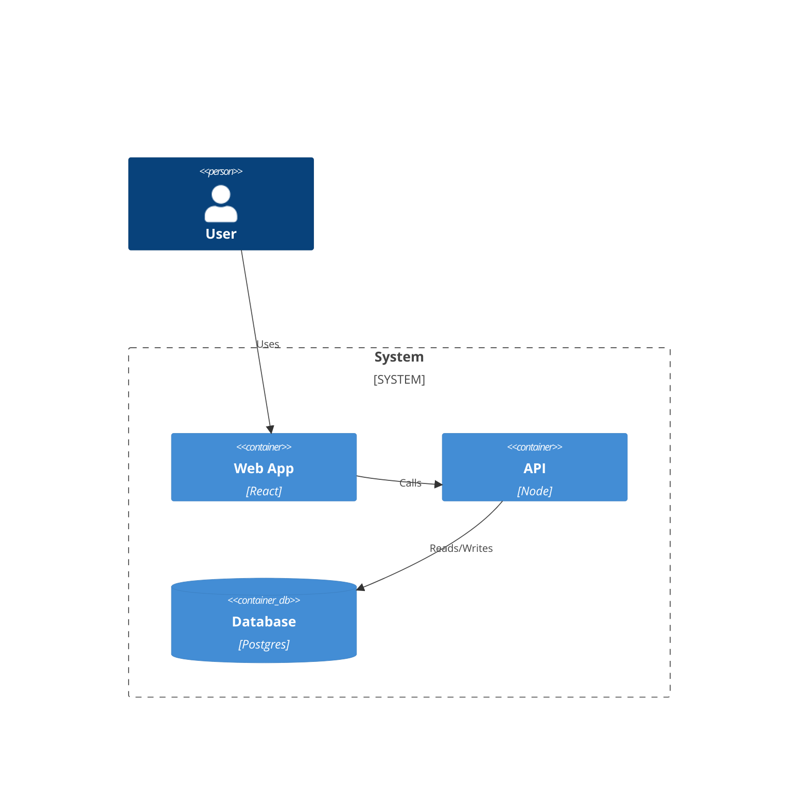
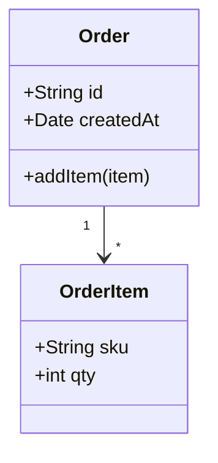

# Diagram Templates

Use these templates as a starting point and adapt to the user's content.

## Mermaid Flowchart

## Mermaid Timeline

## Mermaid Sequence Diagram

## Mermaid ER Diagram

## Mermaid Mindmap

## Mermaid C4 (Container)

## Mermaid Class Diagram

